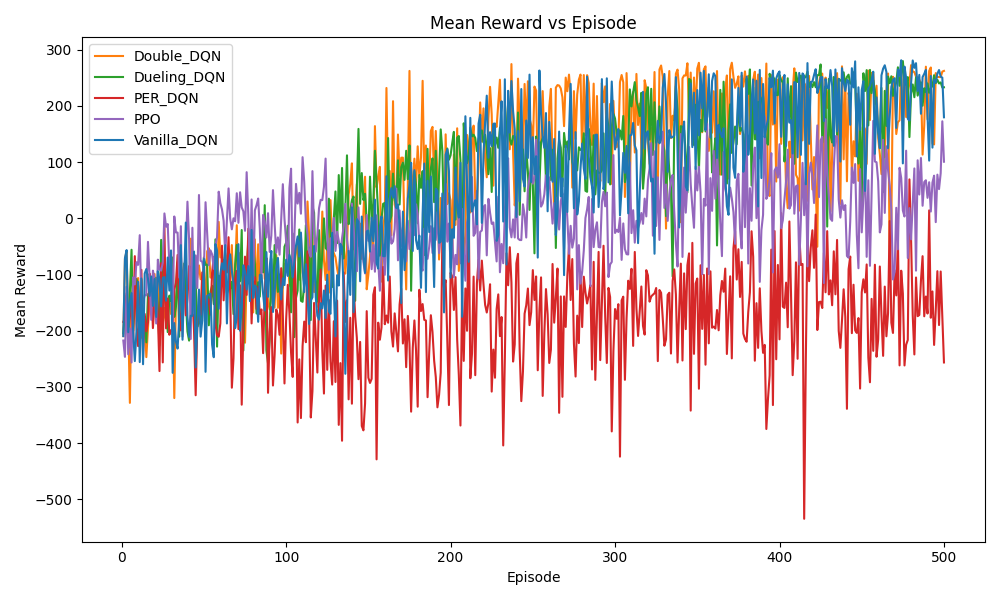
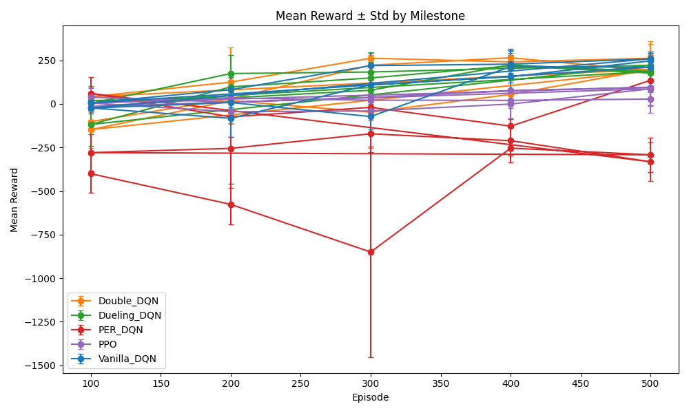
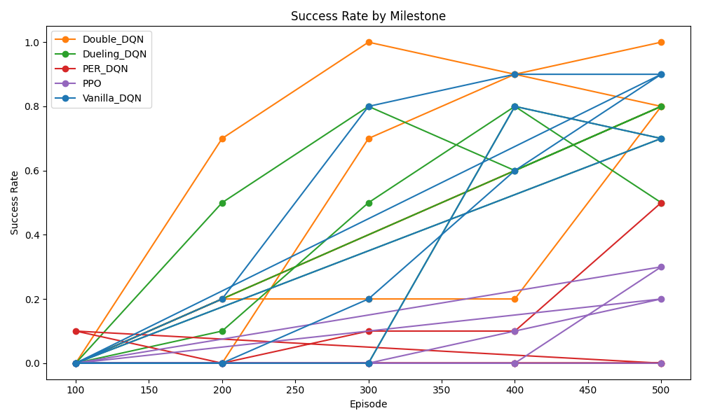

# LunarLander-v3 RL Benchmark: DQN Variants vs PPO

A benchmark and evaluation repository comparing Vanilla DQN, Double DQN, Dueling DQN, PER-DQN, and PPO on Gymnasium `LunarLander-v3`, with preserved result artifacts, extracted RL modules, and a reproducible plot-regeneration path.

## Tech Stack Snapshot

- **RL / ML:** PyTorch, Stable-Baselines3, Gymnasium `LunarLander-v3`
- **Data / Evaluation:** pandas, NumPy, Matplotlib
- **Engineering:** Python, PyYAML, pytest, GitHub Actions
- **Artifacts:** committed CSV logs, plots, milestone videos, archived notebook

## Why This Project Exists

Reinforcement learning comparisons are easy to oversimplify when they focus on a single score from a single run. This project exists to compare several RL approaches under the same environment and fixed training budget, while preserving enough artifacts to review the benchmark after the original training run.

The repo is most useful as an evaluation artifact: it shows custom RL implementation work, multi-seed benchmarking, metric design beyond reward alone, and honest reproducibility boundaries.

## What This Project Builds

This project builds:

- a comparative benchmark across five RL algorithms on `LunarLander-v3`
- a lean Python package for extracted agent, wrapper, metric, and plotting logic
- a stable review path that regenerates plots from committed CSV artifacts
- a small smoke path for code-path verification of the extracted environment and DQN logic
- a minimal test and CI layer around the most reliable artifact-based workflow

This project does **not** present itself as a production RL service or as a fully productized experiment framework.

## Architecture / Workflow

```text
Archived notebook and original benchmark run
-> preserved CSV artifacts under results/final_benchmark/
-> metric loaders and validators in src/lunarlander_benchmark/metrics.py
-> plot generation in src/lunarlander_benchmark/plotting.py
-> regenerated plots in a separate output directory

Extracted RL modules
-> Gymnasium wrapper + seeding
-> DQN-family agent logic
-> tiny smoke config and runner
-> CSV + JSON smoke outputs

Tests and CI
-> validate preserved CSV loading
-> regenerate expected plots
-> verify preserved benchmark plots remain untouched
```

| Component | Purpose |
| --- | --- |
| `src/lunarlander_benchmark/agents.py` | PyTorch DQN-family implementation plus PPO helper |
| `src/lunarlander_benchmark/wrappers.py` | Environment creation, seeding, and fuel tracking |
| `src/lunarlander_benchmark/metrics.py` | CSV validation, metric parsing, and helper metrics |
| `src/lunarlander_benchmark/plotting.py` | Regenerates benchmark plots from committed CSVs |
| `scripts/reproduce_plots.py` | Primary supported reproducibility path |
| `scripts/smoke_run.py` | Tiny Vanilla DQN smoke run for code-path checks |
| `tests/test_smoke_run.py` | Artifact-loading and plot-regeneration checks |
| `.github/workflows/smoke.yml` | CI for the stable artifact-based path |

## Key Features

- Compares Vanilla DQN, Double DQN, Dueling DQN, PER-DQN, and PPO under a fixed 500-episode budget.
- Preserves multi-seed benchmark outputs as committed CSVs, plots, and milestone videos.
- Tracks reward, success rate, landing distance, fuel usage, sample efficiency, training stability, evaluation variance, and compute time.
- Extracts custom DQN-family logic from the original notebook into reusable Python modules.
- Regenerates a full plot set from committed benchmark artifacts without overwriting preserved outputs.
- Includes a minimal smoke runner, pytest checks, and a GitHub Actions workflow for the most stable review path.

## Technical Implementation

### Core components

The DQN family is implemented in PyTorch with a shared `DQNAgent`, replay buffer support, epsilon-greedy action selection, target-network updates, Double DQN target selection, dueling Q-networks, and prioritized replay support. PPO appears as a helper around Stable-Baselines3 rather than a custom policy-gradient implementation.

The environment layer wraps Gymnasium `LunarLander-v3` with deterministic seeding and a `FuelTrackingWrapper` that records remaining fuel in the step/reset info dictionary. This makes fuel a first-class metric in both the preserved benchmark artifacts and the smoke-path outputs.

### Execution flow

The main supported execution path is artifact-based: `scripts/reproduce_plots.py` loads committed benchmark CSVs, validates their schema, and writes regenerated plots into a separate output directory. The smoke path uses `configs/smoke.yaml` plus `scripts/smoke_run.py` to run a deliberately tiny Vanilla DQN loop and write `master_full_training.csv` and `smoke_summary.json`.

### Outputs and verification hooks

The repository includes preserved full-training logs, milestone metrics, trajectory traces, angular velocity distributions, Q-value distributions, plots, and milestone videos under `results/final_benchmark/`. The test layer verifies that the committed CSVs load correctly, the plot reproduction script generates the expected PNG set, and the preserved benchmark plots are not modified during reproduction.

## Data / Inputs / Assumptions

- The primary input is the Gymnasium `LunarLander-v3` environment rather than an external tabular dataset.
- The repository commits benchmark artifacts from a prior run: `master_full_training.csv`, `master_milestone_metrics.csv`, `trajectories.csv`, `angular_velocities.csv`, and `q_values.csv`.
- The benchmark design documented in the repo uses 3 seeds, 500 training episodes per algorithm, and milestone evaluations at episodes 100, 200, 300, 400, and 500.
- The repo assumes plot regeneration from committed CSV artifacts is the most reliable review path.
- The smoke path assumes a working `gymnasium[box2d]` install and is more platform-sensitive than the plot path.
- No private data, production telemetry, or user data is part of this repository.

## Methodology

- Benchmark set: Vanilla DQN, Double DQN, Dueling DQN, PER-DQN, PPO
- Environment: Gymnasium `LunarLander-v3`
- Seeds: `0`, `1`, `2`
- Training budget: `500` episodes per algorithm
- Milestones: `100`, `200`, `300`, `400`, `500`
- Evaluation dimensions: mean reward, success rate, landing distance, fuel usage, sample efficiency, training stability, evaluation variance, compute time

The comparison is intentionally bounded: same environment, same fixed budget, multiple seeds, and milestone checkpoints instead of a single final score. That makes the repo more about comparative evaluation and tradeoff analysis than about claiming a universally best RL algorithm.

## Evaluation / Results

The preserved benchmark shows the DQN family outperforming PPO under the fixed 500-episode budget used here. Double DQN is the strongest overall tradeoff in the preserved results, while Vanilla DQN reaches the highest final mean reward at episode 500.

| Algorithm | Mean reward | Success rate | Mean fuel | Sample efficiency | Mean time (s) |
| --- | ---: | ---: | ---: | ---: | ---: |
| Vanilla DQN | 238.75 | 0.833 | 969.48 | 274559.67 | 4.39 |
| Double DQN | 216.85 | 0.867 | 965.03 | 247508.33 | 3.72 |
| Dueling DQN | 194.81 | 0.667 | 949.49 | 318407.33 | 6.16 |
| PPO | 69.98 | 0.167 | 930.09 | 472093.33 | 9.53 |
| PER-DQN | -162.79 | 0.167 | 983.79 | inf | 0.96 |

Interpretation:

- Double DQN is the best overall benchmark story because it combines the highest preserved success rate with stronger sample efficiency and lower runtime than the stronger alternatives.
- Vanilla DQN has the highest preserved final mean reward, so the conclusion is not “Double DQN wins every metric.”
- PPO improves but trails the stronger value-based methods in this setup.
- PER-DQN is useful as a negative result; it preserves fuel but does not reach the reward regime of the stronger baselines in this benchmark.

More detail is available in [results/benchmark_summary.md](results/benchmark_summary.md) and [docs/findings.md](docs/findings.md).

## Demo / Example Outputs

Preserved plots are committed in [results/final_benchmark/plots](results/final_benchmark/plots/). A few representative outputs:







Milestone videos for each algorithm are also preserved under `results/final_benchmark/videos/`.

## Reproducibility / Quickstart

### Preferred local path

The most reliable way to review this repository is to regenerate plots from the committed CSV artifacts.

```bash
python3 -m venv .venv
source .venv/bin/activate
pip install -r requirements.txt
python3 scripts/reproduce_plots.py --output-dir results/reproduced_plots
```

Expected outcome: 13 regenerated PNG plots written to `results/reproduced_plots/` without modifying `results/final_benchmark/plots/`.

If you rerun into an existing non-empty output directory, either choose a fresh directory or add `--allow-overwrite`.

### Run tests

```bash
python3 -m pytest -q tests/test_smoke_run.py
```

### Smoke path

```bash
python3 scripts/smoke_run.py --config configs/smoke.yaml
```

Expected outcome: a tiny Vanilla DQN run that writes `master_full_training.csv` and `smoke_summary.json` to `results/smoke_run/` by default.

### Environment notes

- Python `3.11` is the safest target for local setup.
- `gymnasium[box2d]` is the main fragile dependency.
- The smoke path requires the full runtime dependencies from `requirements.txt`, including PyTorch and Gymnasium, not just the minimal subset needed for plot reproduction and artifact tests.
- The GitHub Actions workflow validates the artifact-based plot path and pytest checks; it intentionally does not execute the Box2D-backed smoke path.
- The smoke path is intentionally much smaller than the full benchmark and does not reproduce the final results.
- Full 5-algorithm, 3-seed, 500-episode reruns are not the default supported workflow in this repo.

## Repository Structure

Main review-relevant structure:

```text
.
├── README.md
├── LICENSE
├── requirements.txt
├── .github/
│   └── workflows/
│       └── smoke.yml
├── configs/
│   └── smoke.yaml
├── src/
│   └── lunarlander_benchmark/
│       ├── agents.py
│       ├── metrics.py
│       ├── plotting.py
│       └── wrappers.py
├── scripts/
│   ├── reproduce_plots.py
│   └── smoke_run.py
├── tests/
│   └── test_smoke_run.py
├── results/
│   ├── benchmark_summary.md
│   └── final_benchmark/
│       ├── master_full_training.csv
│       ├── master_milestone_metrics.csv
│       ├── trajectories.csv
│       ├── angular_velocities.csv
│       ├── q_values.csv
│       ├── plots/
│       └── videos/
├── docs/
│   ├── findings.md
│   └── academic_archive/
└── notebooks/
    └── lunarlander_v5_archive.ipynb
```

## Ownership / Personal Contribution

This repository originated as an academic group benchmark project. The preserved notebook, benchmark outputs, reports, and slides are kept as historical project artifacts under `notebooks/`, `results/final_benchmark/`, and `docs/academic_archive/`.

The public-facing engineering and portfolio work represented in this cleaned repository includes:

- reorganizing the project into a benchmark-first GitHub structure
- extracting a minimal RL code surface from the archived notebook into `src/lunarlander_benchmark/`
- preserving and documenting the final benchmark CSVs, plots, and milestone videos under `results/final_benchmark/`
- adding `scripts/reproduce_plots.py` as the main supported review path
- adding `scripts/smoke_run.py` and `configs/smoke.yaml` as a tiny code-path verification workflow
- adding `tests/test_smoke_run.py` and `.github/workflows/smoke.yml` for minimal validation on the stable artifact-based path
- rewriting the README and supporting docs around benchmark interpretation, reproducibility, and honest scope

The strongest claim boundary for this repo is: it demonstrates RL benchmark design, artifact curation, minimal code extraction, reproducible plot regeneration, and evaluation-focused storytelling around a preserved LunarLander benchmark. It should not be presented as a production RL platform or as a claim of sole authorship over every original academic artifact.

## Design Decisions and Tradeoffs

| Decision | Why | Tradeoff / Alternative |
| --- | --- | --- |
| Preserve final benchmark artifacts in-repo | Makes the benchmark reviewable without rerunning the full experiment | Larger repository and less emphasis on fresh-clone full training |
| Make plot regeneration the primary supported path | It is the most stable, truthful, and reproducible workflow in the repo | Does not prove end-to-end retraining |
| Keep a tiny Vanilla DQN smoke path | Exercises extracted environment, agent, metric, and output code with limited scope | Not benchmark-quality validation and excludes PPO by default |
| Use custom PyTorch DQN-family code | Shows implementation depth beyond notebook-only library calls | More maintenance than relying entirely on external trainers |
| Keep PPO as a Stable-Baselines3 helper | Preserves a policy-gradient baseline without overbuilding the lean engineering layer | PPO internals are not custom-implemented here |
| Track metrics beyond reward | Makes the comparison more useful for tradeoff analysis | More artifact surface and more interpretation complexity |
| Keep CI on the artifact path only | Avoids flaky Box2D-heavy checks and stays aligned with what is reliably supported | CI does not validate the smoke path or full reruns |

## Limitations / Honest Scope

- This is a benchmark and evaluation repository, not a deployed application or serving system.
- The strongest evidence in the repo is the preserved benchmark artifact set, not a polished full-rerun training framework.
- Full 5-algorithm reruns are not the default supported path.
- The smoke path is intentionally small and should be treated as a code-path check, not as benchmark validation.
- `gymnasium[box2d]` remains platform-sensitive, especially on environments where `box2d-py` and `swig` are brittle.
- The repo does not claim production deployment, business impact, real users, or operational adoption.
- Results are specific to the documented `LunarLander-v3` setup and fixed episode budget; they should not be generalized beyond that scope.

## Future Improvements

- Add a cleaner fresh-clone environment story around Box2D setup and preferred Python versions.
- Expand the smoke path or add a second stable validation path if the environment dependencies become less brittle.
- Add a compact architecture figure for even faster recruiter and interviewer skims.
- Add richer benchmark summaries if future reruns are performed under a reproducible setup.
- Separate archival course materials even more cleanly from the benchmark-first review path.

## Skills Demonstrated

### AI / ML

- reinforcement learning benchmarking
- custom DQN-family implementation in PyTorch
- algorithm comparison across value-based and policy-gradient methods
- metric design beyond reward alone

### Data / Evaluation

- multi-seed experiment tracking
- milestone-based evaluation
- artifact validation and metric parsing from committed CSVs
- benchmark interpretation and negative-result framing

### Engineering / Systems

- modularization of notebook logic into Python modules
- reproducible plot-regeneration workflow
- smoke-test scripting
- pytest-based artifact validation
- GitHub Actions CI for stable review paths

### Product / Communication

- recruiter-readable benchmark framing
- explicit claim boundaries and limitations
- ownership clarification for an academic-origin project
- artifact curation for technical review and interview walkthroughs
